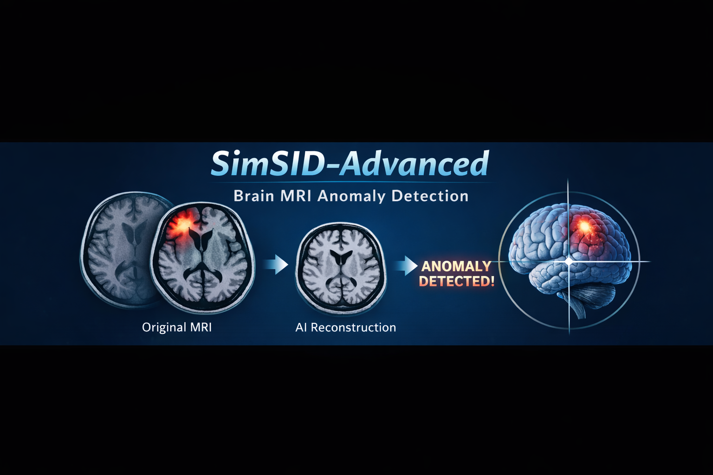

<p align="center">
  
</p>

<h1 align="center">SimSID-Advanced</h1>
<p align="center">
Unsupervised Brain MRI Anomaly Detection via Structural Consistency Modeling
</p>

---

## Overview

SimSID-Advanced is a domain-adapted implementation of the original **SimSID** framework proposed by:

> Xiang, T., et al. (2024).  
> *Exploiting structural consistency of chest anatomy for unsupervised anomaly detection in radiography images.*  
> IEEE Transactions on Pattern Analysis and Machine Intelligence (TPAMI).  
> https://doi.org/10.1109/TPAMI.2024.3382009  

While the original method was designed for chest radiographs, this repository adapts the structural consistency modeling framework for **brain MRI 2D slice-based anomaly detection**.

---

## Research Objective

The goal of this project is to perform fully **unsupervised anomaly detection** on brain MRI images by:

- Training exclusively on normal MRI slices
- Learning structural consistency representations
- Detecting anomalies via reconstruction discrepancies
- Evaluating cross-dataset generalization performance

No pixel-level lesion annotations are required during training.

---

## Datasets

The model was trained and evaluated on multiple independent MRI datasets to test cross-domain robustness.

### Training (Normal Only)

- HCP
- CAMBRIDGE
- IXI
- BEIJING
- OPENNEURO
- FCP

### Anomaly Evaluation

- ATLAS R2.0
- BraTS2017
- BraTS2023
- REMBRANDT
- UCSF BMSR
- FCP

---

## Dataset Download

The prepared dataset (325 MB, ~31,894 files) can be downloaded from:

🔗 **Google Drive**  
https://drive.google.com/drive/folders/1i2nAD_F197ugalcnZZHzngt29ysUYa3M?usp=drive_link

After downloading, organize the directory as:

```
data/
   train/
   val/
   test/
```

Make sure dataset paths are correctly defined in configuration files.

---

## Installation

Create environment:

```bash
conda env create -f environment.yml
conda activate simsid
```

Or manually:

```bash
pip install torch torchvision numpy scipy scikit-learn matplotlib tqdm
```

---

## Training

Run training from terminal:

```bash
python main.py --config configs.karma4_dev --exp <experiment_name>
```

Replace `<experiment_name>` with your custom identifier.

---

## Testing

Full evaluation:

```bash
python main_test_fully.py --config configs.karma4_dev --exp <experiment_name>
```

Ensure:

- Checkpoint paths are correct
- Dataset paths are properly configured

---

## Evaluation Metrics

- AUC-ROC
- AUC-PRC
- Accuracy
- F1-score
- Precision
- Recall

---

## Acknowledgment

Original SimSID implementation:  
https://github.com/MrGiovanni/SimSID

---

## License

For academic and research purposes only.
